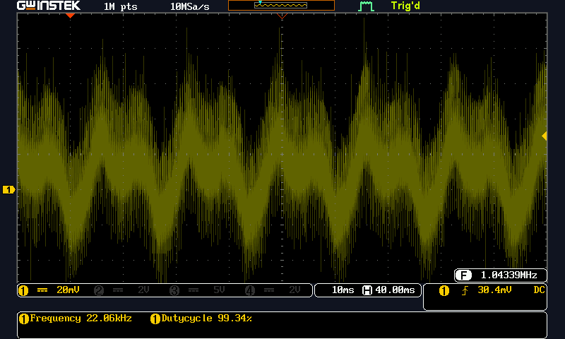
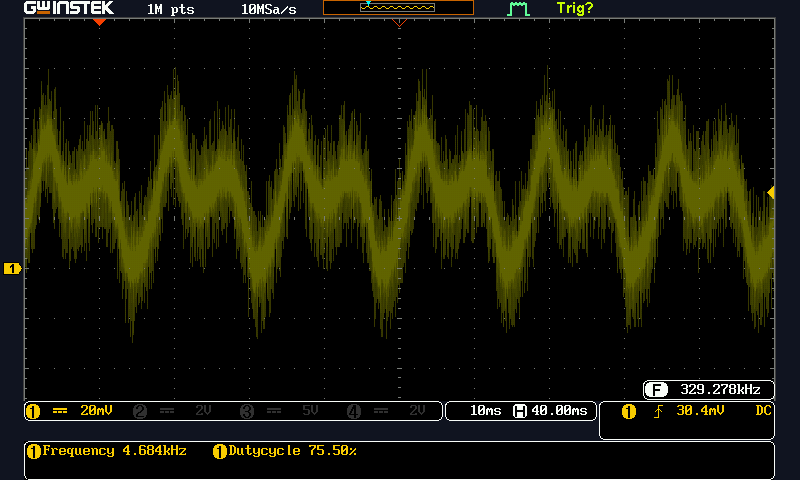
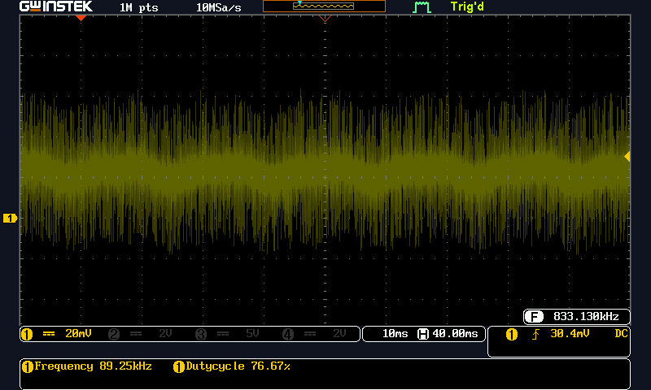
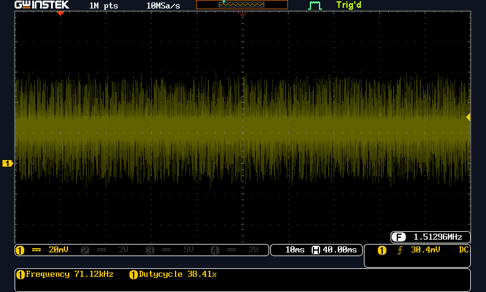
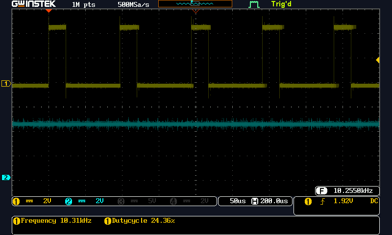
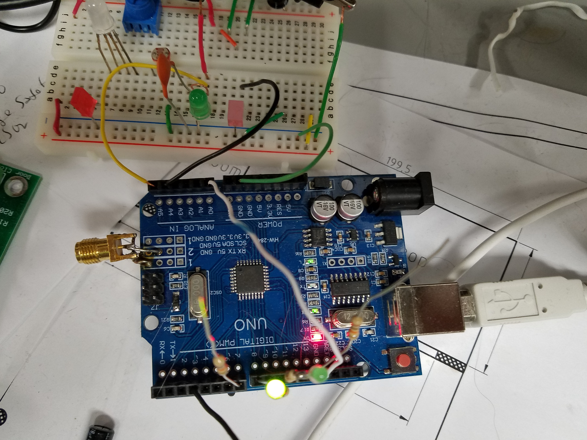

# LEDasSensor
Experiments on Arduino Uno for sensing light with LED as a photo cell.

/*LEDasSensor
   Author: Forrest Erickson
   Date: 20210503
   Description: Experiments on Arduino Uno for sensing light with LED as a photo cell.
   Added a EMA (Exponential Moving Average) to the serial output.  
   In Ardunio, view serial ouput with Serial Ploter CTRL+SHIFT+L. 
   Ref: https://en.wikipedia.org/wiki/Moving_average#Cumulative_moving_average

   Results:
   Comment out all but the AnalogRead for Sensor 1 and the set LED1 code and set for ADC clock 1MHz
   But leaving in the map function.
   The onboard LED is pulsed around the AnalogRead reset to trigger an oscilliscope for measurement.
   The frequency of the main loop is 9.7 to 10.13 KHz. 
   By reducing the The output LED 
   Adding the print statement back in loop reduces the sample rate to 2.5 to 2.9 KHz.

   Based on:
   LED light sensing
   Hunter Carlson
   June 9 2009
   From: https://forum.arduino.cc/t/leds-as-photo-diodes/114569
*/

###  Ripple and Interference on LED
Oscilloscopoe measurement, 10:0 probe on LED Cathode. Arudino ADC input is also connected.
This shows lots of 60Hz and 120Hz ripple as well as very fast spikes.   

###  Hold ARDUINO in Reset Redeuces Interference
Oscilloscopoe measurement, 10:0 probe on LED Cathode. Arudino ADC input is also connected.
This shows lots of 60Hz and 120Hz ripple as well. Much of the fast spikes are gone because they were caused by the ADC connecting to and loading the LED.  

###  Add 2200 pF in parallel with LED
Oscilloscopoe measurement, 10:0 probe on LED Cathode. 
Arudino ADC input is also connected.
This shows much less 60Hz and 120Hz ripple as well. Much of the fast spikes remain. Probaly because of the very skinngy long grounding I am useing with the solderless bread board.

###  Add 100nF in parallel with LED
Oscilloscopoe measurement, 10:0 probe on LED Cathode. 
Arudino ADC input is also connected.
This shows lots no reall 60Hz and 120Hz ripple.

###  Measurement of ADC Sample Time and Sample Period
Measured on Builtin_LED instrumented to toggle. 
The SerialPrintln was commented out to give the fastes sample rate.
ADC clock set to 1MHz.

###  Experimental set up.
The Green Sensor LED is wired to A5.
The indicator LEDs are wired to two pins each because I did not have handy grounds to which I could stretch the leads.

